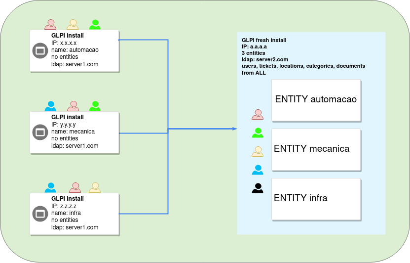

# php-glpi-migration

This is a PHP script for the migration from three different GLPI installs to a fresh new GLPI 10.0.5 install.

  - We create three different entities in the new install representing each old GLPI instances; 
  - We manage and import the users that are similiar on the old GLPI intances to the new one without duplicating them;
  - We import Users, Tickets, Locations, ITIL Categories and Documents from the old instances;
  - Users that are admins, superadmins, supervisors or technicians in an old instance are imported as a technician for their correspondent entity;
  - We use the following GLPI database tables: glpi_users, glpi_useremails, glpi_profiles_users, glpi_locations, glpi_tickets, glpi_tickets_tickets, glpi_tickets_users, glpi_itilfollowups, glpi_itilsolutions, glpi_itilcategories, glpi_documents and glpi_documents_items;
  - We change the user DN for the new one that is configure in the new LDAP base;
  

  

Prerequisites
-----------------------
  - PHP
  - php-mysql
  - php-ldap

Installation && Running
-----------------------

1) Do a git clone of the project:

		git clone https://github.com/dcc6fvo/php-glpi-migration
	
2) Specify your parameters on Params.sample.php. Copy your modified file to Params.php.

3) Execute the PHP script:

       php Main.php 2>&1 > logs/log.txt
   
Feel free to modify this code as you wish!
